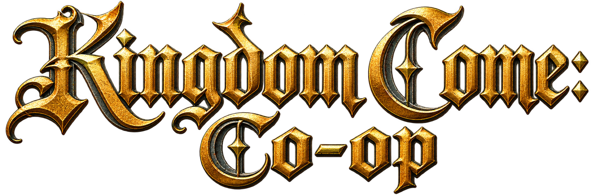

<p align="center">
  
</p>

<h1 align="center">Kingdom Come: Co-op</h1>
<p align="center"><em>ม็อด co-op ไม่เป็นทางการสำหรับ Kingdom Come: Deliverance II — เพิ่มผู้เล่น Xbox Game Pass และ "โลกกลาง"</em></p>

<p align="center">
  <a href="https://github.com/ILliTAH/KingdomCome-Together/releases"></a>
  
  <a href="LICENSE"></a>
  
</p>

**English summary.** A fork of [Kingdom Come: Together](https://github.com/DeepFriedDepp/KingdomCome-Together) at tag `0.18.2`. It lets **Xbox Game Pass** players join a stock 0.18.2 session, and adds **Host World**: a dedicated host machine that nobody plays on decides where the NPCs are, and every player's game displays it. One installer (`KingdomCome-Coop-Setup`) carries everything -- the stock launcher with both builds added, the agent, the relay, the native plugin, the mod and a skip save -- so nothing else has to be installed first. The installer, the launcher and the Game Pass path are tested on a live game; the Steam and dedicated-host paths have never been run. Details: [docs/HOST-WORLD-GUIDE.md](docs/HOST-WORLD-GUIDE.md) (Thai) and [docs/GAMEPASS-FORK-CHANGELOG.md](docs/GAMEPASS-FORK-CHANGELOG.md) (English). If your friends play **KCD:MP** (kcd-mp.com, dedicated servers on an empty map) rather than Together, this cannot reach them -- use [KCD:MP on Xbox Game Pass](https://github.com/ILliTAH/kcdmp-gamepass) instead.

> **ไม่เกี่ยวข้องกับ Warhorse Studios** — Kingdom Come: Deliverance เป็นเครื่องหมายการค้าของ Warhorse Studios
> โปรเจกต์นี้เป็นงานแฟนเมดที่ไม่แสวงกำไร และยังเป็นรุ่นทดลอง ควรสำรองเซฟก่อนเล่น

> **เพื่อนของคุณเล่น KCD:MP (kcd-mp.com) ไม่ใช่ Together?** ชุดนี้ต่อไม่ถึงเซิร์ฟเวอร์ของ KCD:MP (คนละเครือข่ายกัน)
> ผู้เล่น Game Pass ที่จะเข้า KCD:MP ใช้ **[KCD:MP on Xbox Game Pass](https://github.com/ILliTAH/kcdmp-gamepass)** แทน —
> ตารางเทียบว่าแบบไหนใช้กับอะไรอยู่ใน README ที่นั่น (สั้น ๆ: เพื่อนส่ง `ip:7777` = KCD:MP, ส่ง `ip:7778` หรืออยากเล่นเนื้อเรื่องด้วยกัน = ชุดนี้)

---

## fork นี้เพิ่มอะไรจาก KCDMP 0.18.2

| | ตัวเดิม 0.18.2 | fork นี้ |
|---|---|---|
| ผู้เล่น **Xbox Game Pass** | เล่นไม่ได้ (ต้องใช้ Steam + Modding Tools) | **เล่นได้** — agent คุยกับเกมผ่าน RemoteConsole แทน debug API |
| ตำแหน่ง NPC | แต่ละเครื่องคิดเอง ยืมกันได้ 5 ตัวในระยะ 30 ม. แล้วแย่งกัน | **Host World** — เครื่องโฮสต์แยก (ไม่มีคนเล่น) เป็นโลกกลาง รายงาน 40 ตัวในระยะ 60 ม. เครื่องผู้เล่นทุกเครื่องแสดงผลตาม |
| เครื่องโฮสต์ | ไม่มี | มีตัวเปิด (relay + เกม + agent) สำหรับเครื่องเซิร์ฟเวอร์: โหลดเซฟเอง ย่อหน้าต่างเกม ไม่ต้องมีคนนั่ง — **ยังไม่เคยรันกับเกมจริง** |
| เซฟข้ามบทนำ | แจกแยกในหน้า release | อยู่ในตัวติดตั้ง; launcher วางให้ (Steam) และเครื่องโฮสต์โหลดเอง |
| ตัวแทนของเพื่อน (ฝั่ง Game Pass) | — | หุ่นเชิดไม่มี AI ลอกหน้าตาจากตัวเรา เดินต่อเนื่อง ฟันให้เห็น |
| ตัวติดตั้ง + launcher | `KCDMP-Setup` (Steam เท่านั้น ต้องมี Modding Tools ก่อนถึงจะติดตั้งได้) | `KingdomCome-Coop-Setup` ตัวเดียว ใช้ได้ทั้ง Game Pass / Steam / เครื่องโฮสต์ — launcher หน้าตาเดิม หาเกมเอง วางม็อดให้ตอนกดเล่น |

**ไม่ต้องลง KCDMP ตัวเดิมหรือม็อดอื่นก่อน** — ตัวติดตั้งนี้มีครบ: launcher, agent, relay, native plugin, ม็อด และเซฟข้าม
agent ยังรายงานเวอร์ชัน `0.18.2` และ wire protocol ไม่เปลี่ยน จึงใช้ relay ของ 0.18.2 ตัวเดิมได้ และเล่นร่วมกับผู้เล่น Steam ที่ยังใช้ KCDMP 0.18.2 ตัวเดิมได้

## ติดตั้งและเล่น

1. ดาวน์โหลด **`KingdomCome-Coop-Setup-0.18.2.exe`** จาก [หน้า Releases](https://github.com/ILliTAH/KingdomCome-Together/releases) แล้วรัน
   ไม่ต้องลงอะไรก่อน ไม่ต้องใช้สิทธิ์ admin
2. เปิด **Kingdom Come Co-op** จากไอคอนบนเดสก์ท็อป — launcher หาเกมในเครื่องเอง:
   Kingdom Come: Deliverance II จาก **Xbox Game Pass** หรือ **KCD2 Modding Tools** จาก Steam
3. กด **ADD SERVER** ใส่ที่อยู่ของเครื่องที่เปิดเซิร์ฟเวอร์ แล้วกด **JOIN SERVER**

| เครื่องของคุณ | กด | เกิดอะไรขึ้น |
|---|---|---|
| ผู้เล่น **Xbox Game Pass** | JOIN SERVER | วางม็อดลงเกม เปิดเกม เกมโหลดเซฟล่าสุดเอง แล้วต่อเซิร์ฟเวอร์ — ไม่ต้องกดอะไรต่อ (ครั้งแรกมี UAC หนึ่งครั้ง เพื่อสร้างกฎ firewall) |
| ผู้เล่น **Steam** (ต้องมี KCD2 Modding Tools ซึ่งฟรีใน Steam library) | JOIN SERVER → โหลดเซฟ → CONNECT | วางม็อดและเซฟข้ามลงเกม เปิดเกม; เมื่อเดินได้แล้วกด CONNECT เพื่อฉีด plugin และต่อเซิร์ฟเวอร์ (ขั้นตอนเดียวกับ launcher ต้นฉบับ) |
| เปิดเซิร์ฟเวอร์ให้เพื่อนแล้วเล่นไปด้วย | HOST GAME → START GAME | เปิด relay บนเครื่องนี้ และบอกที่อยู่ที่ต้องส่งให้เพื่อน |
| **เครื่องเซิร์ฟเวอร์**ที่ไม่มีคนเล่น (Steam, ต้องมี GPU) | HOST GAME → RUN AS WORLD HOST | เปิด relay + เกม โหลดเซฟข้ามเอง ย่อหน้าต่างเกม เป็นโลกกลางให้ทุกคน |

**ทุกเครื่องในเซสชันต้องใช้ตัวติดตั้งจาก release เดียวกัน** ติดตั้งที่ `%LOCALAPPDATA%\KCDMP-HostWorld` แยกจาก KCDMP ตัวเดิม
(ลงคู่กันได้ แต่ในเกมมีโฟลเดอร์ม็อดเดียว: launcher ของ fork นี้วางม็อดของตัวเองทับทุกครั้งที่กดเล่น)
รายละเอียดอยู่ใน `README-TH.md` ในโฟลเดอร์ที่ติดตั้ง

```
 เครื่องเซิร์ฟเวอร์ (Steam)  ── relay :7778 + เกม = โลกกลาง  ("[HOST] world")
        ▲                         ▲
 ผู้เล่น Steam (guest)        ผู้เล่น Game Pass (guest)
```

**โฮสต์คือเครื่องเซิร์ฟเวอร์แยก ไม่มีใครเล่นบนเครื่องนั้น** ผู้เล่นทุกคน (Steam และ Game Pass) เป็น guest
เครื่องผู้เล่นไม่เป็นโฮสต์เองไม่ว่ากรณีใด — ถ้าเครื่องโฮสต์ไม่ได้เปิดอยู่ ม็อดทำงานแบบ 0.18.2 เดิม (ไม่มีโลกกลาง)

KCD2 ไม่มีโปรแกรม dedicated server: เครื่องโฮสต์รันตัวเกมเต็ม ๆ แบบไม่มีคนนั่ง (โหลดเซฟเอง หน้าต่างย่ออยู่) จึง**ต้องมี GPU**
ดู [docs/HOST-WORLD-GUIDE.md §3](docs/HOST-WORLD-GUIDE.md) ว่าทำได้แค่ไหน

## สถานะ: อะไรทดสอบแล้ว

| ส่วน | สถานะ |
|---|---|
| ผู้เล่น Game Pass เล่นกับผู้เล่น Steam 0.18.2 ผ่าน relay จริง | **ทดสอบกับเกมจริงแล้ว** (2026-09-30) |
| ตัวแทนเพื่อนไม่มี AI / เดินต่อเนื่อง / ท่าฟัน / อากาศหลังโหลดเซฟ | **ทดสอบกับเกมจริงแล้ว** |
| เกม Game Pass โหลดเซฟล่าสุดเองตอนเปิด (`user.cfg`) | **ทดสอบกับเกมจริงแล้ว** |
| ตัวติดตั้ง exe + launcher บนเครื่อง Game Pass: ติดตั้ง, หาเกมเอง, JOIN SERVER → เกมเปิด โหลดเซฟเอง ต่อ relay, ถอนการติดตั้ง | **ทดสอบกับเกมจริงแล้ว** |
| launcher ฝั่ง Steam (วางม็อด, ฉีด native plugin ที่ build จาก source ของ 0.18.2 ด้วย Visual Studio 2019) | **ยังไม่เคยรัน** |
| Host World: กติกา host–guest, โฮสต์รายงาน 40 ตัว, NPC เคลื่อนที่ต่อเนื่อง, ซ่อนตัวละครโฮสต์ | ผ่านชุดเทสต์ — **ยังไม่เคยรันกับเกมจริง** |
| ม็อดของ fork นี้บนเกม Steam / Modding Tools | **ยังไม่เคยรัน** |
| เครื่องโฮสต์ (ปุ่ม RUN AS WORLD HOST / `Start-WorldHost`): โหลดเซฟเอง ย่อหน้าต่าง ฉีด plugin และการให้โฮสต์ตามผู้เล่น | **ยังไม่เคยรัน** |

งานทั้งหมดทำบนเครื่อง Game Pass ซึ่งรันเกม Steam ไม่ได้ — ฝั่ง Steam และเครื่องโฮสต์ต้องตรวจตาม
[รายการใน docs/HOST-WORLD-GUIDE.md](docs/HOST-WORLD-GUIDE.md) ก่อนใช้จริง

## ฟีเจอร์ต่อแพลตฟอร์ม

| | ผู้เล่น Steam | ผู้เล่น Game Pass |
|---|---|---|
| เห็นผู้เล่นอื่น เดิน วิ่ง ป้ายชื่อ | ✅ | ✅ |
| ส่งตำแหน่ง เลือด stamina ของเรา | ✅ | ✅ |
| ท่าฟันของผู้เล่นอื่น | ✅ (native) | ✅ (คลิปฟันจริง) |
| สภาพอากาศและเวลาตามเซสชัน | ✅ | ✅ |
| NPC ตามโลกของเครื่องโฮสต์ (ตำแหน่ง เดิน/วิ่ง ถืออาวุธ) | ✅ | ✅ |
| คุยเสียงตามระยะ, Farkle | ✅ | ยังไม่ได้ทดสอบ |
| ชุดเกราะ/อาวุธของผู้เล่นอื่นตรงกับของจริง | ✅ | ❌ (ตัวแทนลอกหน้าตาจากตัวเราแทน) |
| ความเสียหาย/การตายข้ามเครื่อง | ✅ | ❌ |
| ไอคอนผู้เล่นบนแผนที่ | ❌ | ❌ |

✅ = รองรับ ไม่ได้แปลว่าทดสอบแล้วทุกข้อ — ดูตาราง "สถานะ" ข้างบนว่าข้อไหนทดสอบกับเกมจริงแล้ว
คอลัมน์ Steam คือความสามารถของ 0.18.2 ตัวเดิม ดู [README ของ 0.18.2](https://github.com/DeepFriedDepp/KingdomCome-Together/blob/0.18.2/README.md)
สำหรับรายละเอียด วิธีเล่น Farkle และข้อจำกัดของตัวเดิม
Game Pass ทำแถว ❌ ไม่ได้เพราะไม่มี debug API และ native plugin ของ build Modding Tools

## ข้อจำกัดของ Host World

- ผู้เล่นต้องอยู่บริเวณเดียวกับโฮสต์ (ราว 60 ม.) — เกมของโฮสต์คำนวณ NPC ละเอียดเฉพาะรอบตัวมัน ไกลกว่านั้นแต่ละคนเห็นโลกของตัวเอง
- กิจกรรมของ NPC (นั่ง ทำงาน คุย) ไม่ถูกส่ง — guest เห็นแค่ เดิน / วิ่ง / ยืน / ถืออาวุธ
- เควส บทสนทนา ร้านค้า หีบ ยังเป็นของใครของมัน
- เครื่องโฮสต์กับเครื่องส่วนตัวใช้บัญชี Steam เดียวกันเปิดเกมพร้อมกันไม่ได้
- ตัวละครของโฮสต์ไม่มีใครเล่น แต่ยังถูก NPC ตีได้ — ยังไม่มีโค้ดป้องกัน

ความเสี่ยงและงานค้างทั้งหมดเรียงตามความสำคัญอยู่ใน [docs/HOST-WORLD-GUIDE.md §5](docs/HOST-WORLD-GUIDE.md)

## ความปลอดภัย

- เกม Game Pass ต้องเปิดด้วย `-devmode` ซึ่งเปิดพอร์ต **4600** ที่ไม่มีรหัสผ่าน — ครั้งแรกที่กด JOIN สคริปต์สร้างกฎ firewall บล็อกเครื่องอื่นให้ (ขอสิทธิ์ admin ครั้งเดียว)
- บนเครื่องเซิร์ฟเวอร์ เปิดออกนอกเครื่องเฉพาะ **TCP 7778** (relay) — ห้ามเปิด `:1403` หรือ `:4600`
- ที่อยู่เซิร์ฟเวอร์ที่คุณเพิ่มไว้เก็บในโฟลเดอร์ที่ติดตั้งบนเครื่องของแต่ละคน (`custom_servers.json`) ไม่อยู่ใน repo และไม่อยู่ในตัวติดตั้ง

## สำหรับนักพัฒนา

ต้องมี [.NET 8 SDK](https://dotnet.microsoft.com/download) ขึ้นไป และ Python 3 + `pip install lupa`
สร้างตัวติดตั้งต้องมีเพิ่ม: [Inno Setup 6](https://jrsoftware.org/isinfo.php) (`winget install JRSoftware.InnoSetup`) และ Visual Studio ที่มี C++ x64
(native plugin ต้องใช้ CMake 3.21 ขึ้นไป — Visual Studio 2019 ให้มา 3.20 ให้ `pip install cmake` เพิ่ม)

```powershell
cd dotnet
dotnet test KcdMp.Client.Tests -c Release      # agent: RemoteConsole, log tail, world host (43 tests)
dotnet test KcdMp.Launcher.Tests -c Release    # launcher: หาเกม บอกว่าขาดอะไร วางม็อด คำสั่งที่ส่งให้สคริปต์ (36 tests)
dotnet test KcdMp.Farkle.Tests -c Release      # ของเดิม (59 tests)
cd ..
python tools\Test-GamePassLua.py               # ม็อด: รัน kdcmp.lua ทั้งไฟล์บน Lua 5.1 โดยจำลองเกม
powershell -File tools\Test-PackageScripts.ps1 # สคริปต์ใน package\ ส่วนที่ไม่ต้องมีเกม
powershell -File tools\Build-And-Install-Mod.ps1 -NoInstall   # สร้าง kdcmp.pak ใหม่หลังแก้ Lua
powershell -File tools\Build-Installer.ps1                    # สร้าง release\KingdomCome-Coop-Setup-<VERSION>.exe
```

| ที่ | มีอะไร |
|---|---|
| `dotnet/KcdMp.Client/` | agent — ของ fork นี้: `RemoteConsole*.cs`, `ILuaCommandSink.cs`, การแก้ใน `LogTailGameTransport.cs` และ `GameBridge.cs` |
| `dotnet/KcdMp.Client.Tests/` | เทสต์ของ agent รวม RemoteConsole จำลองที่บังคับกติกาเดียวกับเกมจริง |
| `kdcmp/` | ม็อด (Lua + `kdcmp.pak`) — ค้นคำว่า `Game Pass fork` และ `Host world` ใน `kdcmp.lua` |
| `KCDMP_launcher/` | launcher — ของ fork นี้: `Models/GameInstalls.cs` (หาเกมสองแบบ), `ModPackage.cs` (วางม็อด/เซฟตอนกดเล่น), `ScriptLauncher.cs` และส่วนที่แก้ใน `Home.razor.cs`, `SettingsModal.razor`, `HostInfoModal.razor` |
| `installer/KCDMP.iss` | ตัวติดตั้งของ fork นี้ (ไม่บังคับว่าต้องมี Steam, AppId ของตัวเอง) |
| `package/` | `Start-GamePass`, `Start-WorldHost` ที่ launcher เรียก, `Uninstall-GameChanges` และเซฟข้าม (`save/`) — ติดตั้งไว้ข้าง launcher |
| `tools/Test-GamePassLua.py` | เทสต์ม็อดแบบ offline |
| `dotnet/KcdMp.Server/`, `KcdMp.MasterServer/`, `KcdMp.Protocol/`, `native/` | ของ 0.18.2 ไม่ได้แก้ (native plugin build ใหม่จาก source เดิม) |

เอกสาร:
- [docs/HOST-WORLD-GUIDE.md](docs/HOST-WORLD-GUIDE.md) — ติดตั้ง รัน รายการตรวจสอบ ความเสี่ยง ปุ่มปรับ (สำหรับผู้ดูแลเครื่องเซิร์ฟเวอร์)
- [docs/GAMEPASS-FORK-CHANGELOG.md](docs/GAMEPASS-FORK-CHANGELOG.md) — ทุกอย่างที่เปลี่ยนจาก 0.18.2 พร้อมตัวเลขที่วัดได้
- [docs/superpowers/specs/2026-09-30-host-world-npc-sync-design.md](docs/superpowers/specs/2026-09-30-host-world-npc-sync-design.md) — แบบของ Host World
- [docs/LAUNCHING.md](docs/LAUNCHING.md), [docs/NETWORKING.md](docs/NETWORKING.md) — ของ 0.18.2 (ฝั่ง Steam และการตั้ง relay)

## License และที่มา

[GNU General Public License v3.0](LICENSE) เหมือนต้นทาง

สายของโปรเจกต์: [`marczukmichal/kcd2-multiplayer`](https://github.com/marczukmichal/kcd2-multiplayer) (แนวคิดและตัวแรก)
→ [`DeepFriedDepp/KingdomCome-Together`](https://github.com/DeepFriedDepp/KingdomCome-Together) (พัฒนาต่อโดยได้รับอนุญาตจากผู้พัฒนาเดิม)
→ fork นี้ แยกจาก tag `0.18.2` เมื่อ 2026-09-30 เครดิตของตัวม็อดทั้งหมดเป็นของสองโปรเจกต์ข้างต้น
fork นี้เพิ่มเฉพาะส่วน Game Pass และ Host World ตามที่ระบุไว้ใน changelog
